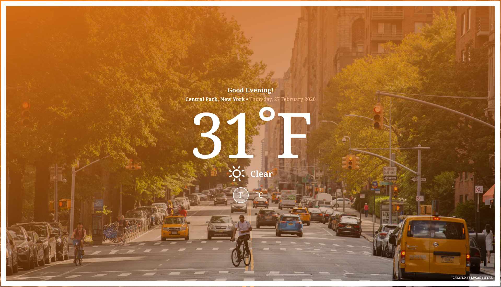

# Weather App #
Simple and basic weather app.
This app is a way I can keep up-to-date to the technology as it evolves.
I started it 10 years ago as a General Assembly class project and it's become my experimental sandbox.

I've written it in vanilla JS (spaghetti code) with Bower and Grunt as build tools, later on I converted it into a modular code approach using jQuery and finally with the help of Jules by Google I was able to rewrite the entire app in React and TypeScript using the latests tools there are out there.

<h1 align="center">
  
</h1>

### Project link ###
[Launch Project]

### Update ###

#### Sometime back in 2020
* Complete code refactor using Modular Javascript Design Pattern
* Replace Grunt with webpack
* Improved search image API

#### Jun 2025
* Complete rewrite in React and TypeScript
* Introducing tools like TanStack Query for fetching data from the server
* Implementing recently learned code best practices at Frontend Masters workshop by the amazing David K.

### TO-DO
* Find a good way to deal with env files in GH-pages

Still a lot to come hopefully

[Launch Project]: https://lucasbittar.github.io/weatherapp/ "WeatherApp"
